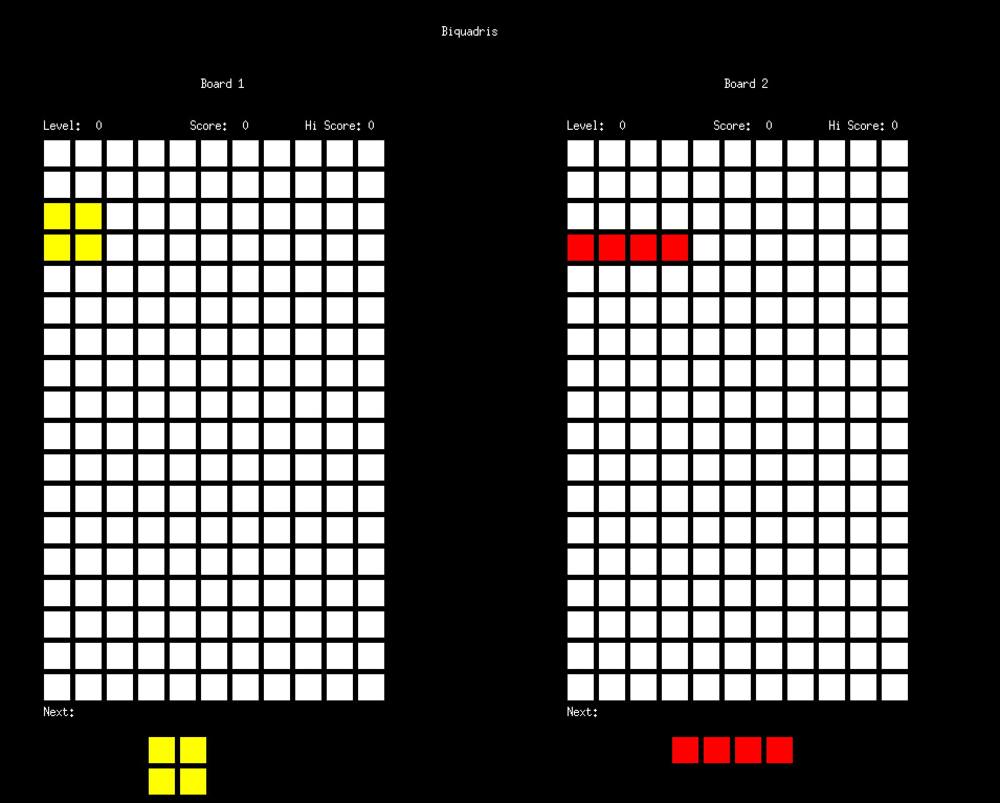

# Biquadris
CS 246 Final Project

## Introduction:
This is a two-player battle game called Biquadris, implemented in C++ and based on xquartz.  The game offers an exciting gameplay experience, requiring strategic thinking and quick decision-making.

## Key Features:

**Two-player Battle:** Biquadris is designed for two players, allowing you to compete against your friends or challenge an AI opponent.

**Boards and Blocks:** Each player has their own board where they strategically place blocks.  The game provides several types of blocks, each with its own unique shape.

**Difficulty Levels:** Biquadris offers four different difficulty levels, catering to players of varying skill levels.  Each level has its own set of rules, adding depth and challenge to the game.

**Scoring and Row Clearing:** When a player fills an entire row with blocks, the row is cleared, and the player earns points.  Clearing multiple rows simultaneously scores even more points.

**Game Over Condition:** If a player is unable to place a block on the board, the game ends for that player.  The remaining player claims victory.

**Turn-Based Gameplay:** Unlike real-time games like Tetris, Biquadris is turn-based.  Players have ample time to strategize and plan their moves, including previewing the shape of the next block.

**High Cohesion and Low Coupling:** The Biquadris game follows the design principle of high cohesion and low coupling. 

## Rules:
#### All commands: 
**reft:** move the current block to the left
**right:** move the current block to the right
**down:** move the current block downward
**drop:** drop the current block
**clockwise:** rotates the block 90 degrees clockwise
**counterclockwise:** rotates the block 90 degrees counterclockwise
**levelup:** increases the current level by one
**leveldown:** decreases the current level by one
**norandom file:** in levels 3 and 4, taking input from the sequence file
**random file:** in levels 3 and 4, taking input randomly
**sequence file:** executes the sequence of commands in file
**I, J, L, O, S, Z, T:** changes the current undropped block
**restart:** clears the board and starts a new game

#### Special actions: 
If a player, upon dropping a block, clears two or more rows simultaneously, a special action is triggered.
**blind:** let the opponent’s board, from columns 3-9, and from rows 3-12, is covered with question marks (?), until the player drops a block
**heavy:** every time a player moves a block left or right, the block automatically falls by two rows
**force block:** change the opponent’s current block to block

#### Levels: 
**Level 0:** 
Takes blocks in sequence from the files file1.txt (for player 1) and file2.txt (for player 2).

**Level 1:**
The block selector will randomly choose a block. Block S and Z are selected with probability 1/12 each, and the other blocks are selected with probability 1/6 each.

**Level 2:**
All blocks are selected with equal probability.

**Level 3:**
The block selector will randomly choose a block. Block S and Z are selected with probability 2/9 each, and the other blocks are selected with probability 1/9 each.
Every command to move or rotate the block will be followed immediately and automatically by a downward move of one row.

**Level 4:**
In addition to the rules of Level 3, in Level 4, every time you place 5 blocks without clearing at least one row, a 1x1 block is dropped onto your game board in the centre column.

## Getting Started:

To get started with Biquadris, simply clone this repository and follow the instructions in the documentation.  Make sure you have the necessary dependencies, including XQuartz, set up on your system.
